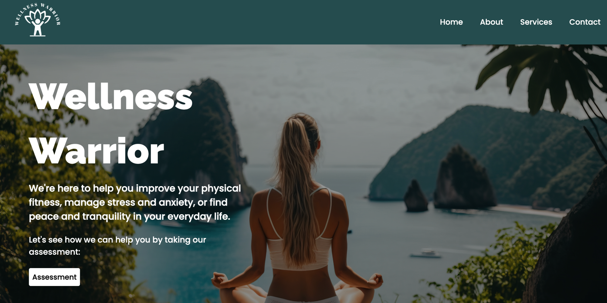

# <h1 align="center">**Wellness Warrior**🧘‍♀️</h1>

 

# Table of contents
- [Overview](#overview)
  - [Objective](#objective)
  - [Screenshot](#screenshot)
  - [Links](#links)
- [Our process](#our-process)
  - [Technologies Used](#technologies-used)
  - [What we learned](#what-we-learned)
  - [Usage](#usage)
  - [Future Development Ideas](#future-development-ideas)
  - [Author](#author)
  - [Credits](#credits)

## Overview

Wellness Warrior is designed to help users cope with stress, anxiety, depression, and other mental health conditions through an assessment questionnaire. Based on the input, the app calculates the severity of the user's mental health condition and provides advice on support services available to them.

 

Another useful feature of the app is its place finder tool. Users can search for nearby fitness centers such as gyms, yoga studios, and running tracks. The app will return the fitness centers and their addresses, making it easy for users to access exercise facilities that can improve their mental and physical health.

 

### Objective
As a team, we aimed to develop a wellness app that catered to individuals seeking to manage their mental health and improve their overall well-being. Our approach involved ideating, collaborating, and executing the application's development, right from its initial phase to deployment. Our end objective was to deliver a minimum viable product that met the requirements for release

### Screenshot

### Links

- Live Site URL: https://cosmic-gaufre-4af241.netlify.app/
- GitHub Url: https://github.com/Aymussa/Wellness-Warrior.git

## Our process

As a team, we collaborated to generate and exchange ideas, taking notes and developing wireframes using Figma to outline the design of our web application. To manage the project, we utilized GitHub Projects and Kanban boards to delegate tasks and track progress.

### Technologies Used

- [x] React.JS
- [x] React Hooks
- [x] Tailwind
- [x]CSS
- [x] HTML5
- [x] API
- [x] NodeJs
- [x] jQuery
- [x] Google Slides
- [x] Figma (Wireframing)
- [x] Netlify (Deployment)
- [x] Git 
- [x] GitHub

### What we learned

At first, getting accustomed to React and its components proved to be challenging for us. Also, incorporating other technologies such as Tailwind CSS and styling the webpage according to our preferences was also a struggle yet an enjoyable experience.

 

Throughout this process, we also enhanced our teamwork skills, making sure that every member made valuable contributions, and that our ideas were effectively translated into the application.

### Usage

Wellness Warrior will take you to a user-friendly app where you can take control of your well-being. We have created a quick 10-question assessment with lifestyle support to help users improve their overall well-being and feel their best. Answering those 10 questions will provide you with advice based on the severity of your responses. It will provide you with resources to help you maintain a positive wellbeing.

### Future Development Ideas

 As we continue to develop and improve Wellness Warrior, here are some potential features and improvements we plan to implement:

+ Integrate more features for personalized well-being plans based on the user's assessment results
+ Incorporate machine learning algorithms to provide more accurate assessment results and personalized recommendations
+ Implement a community forum or support group feature to connect users with others who are also dealing with mental health conditions.
+ Add more educational resources on mental health and wellbeing, such as podcasts, videos, blogs and articles.
+ Allow users to create an account so that they can login and access whenever required

### Author

+ Jessie Kinganga
  - GitHub - [KingJessie](https://github.com/KingJessie)

+ Ahmed Mussa
  - GitHub - [AhmedMussa](https://github.com/Aymussa)

+ Abby Egbo
  - GitHub - [AbbyEgbo](https://github.com/AbbyIT)

+ Laly Firoze
  - GitHub - [LalyFiroze](https://github.com/LalyF)

### Credits
+ Tailwind CSS Documentation
+ npm Documentation
+ AdobeStock Images
+ Google Fonts
+ Foursquare Places API
+ Pexels: [Photo by Gustavo Fring](https://www.pexels.com/photo/group-of-young-pregnant-women-meditating-in-spacious-studio-3984341/)

